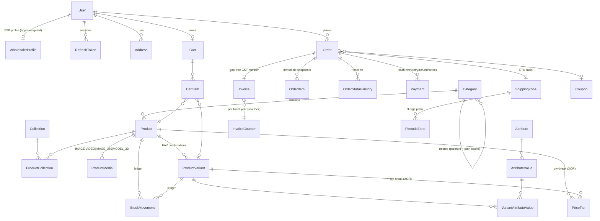
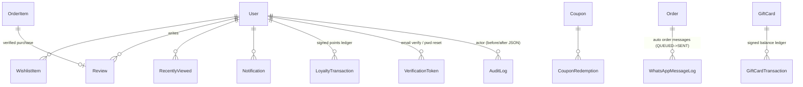

# Amity Art's — Entity Relationship Diagram

~34 models. Money = `Decimal(12,2)` INR. Soft-delete (`deletedAt`) only on User, Category, Product, ProductVariant. Append-only ledgers: AuditLog, StockMovement, OrderStatusHistory, LoyaltyTransaction, GiftCardTransaction.

## Core commerce graph

## Supporting graph

## Design invariants (enforced in DB via raw-SQL migration)

| Invariant | Mechanism |
|---|---|
| PriceTier targets exactly one of product/variant | `CHECK num_nonnulls(productId, variantId) = 1` |
| Stock never negative (oversell guard) | `CHECK stockQty >= 0` + conditional `UPDATE … WHERE stockQty >= n` |
| Review rating 1–5, quantities > 0 | CHECK constraints |
| Variant combination unique per product | `@@unique([productId, combinationHash])` (sorted value-id SHA-256) |
| GST invoice numbers gap-free per fiscal year | `InvoiceCounter` incremented under `SELECT … FOR UPDATE` |
| Order history immutable | OrderItem snapshots (name/sku/price/tax/attrs JSON); addresses as JSON snapshots |

## Wholesale size-matrix mapping

A bangle in *Gold* with sizes 2.2/2.4/2.6/2.8 = **4 variants** sharing `matrixKey = "gold"`. The Size attribute has `isSizeAxis = true`; the wholesale cart renders one row per `matrixKey` with a quantity column per size value. Each cell → one CartItem/OrderItem pointing at its exact variant, so stock/pricing stay per-variant. Tier `minQty` is evaluated against the sum across the matrixKey group.

## Delivery ETA (both channels)

`warehouse.pincode` SiteSetting (default **400064**, admin-editable) → customer pincode first-3-digit prefix → `PincodeZone` → `ShippingZone(minDays, maxDays)`; falls back to the `shipping.defaultZoneName` zone; adds `shipping.outOfStockLeadDays` when stock is 0.
